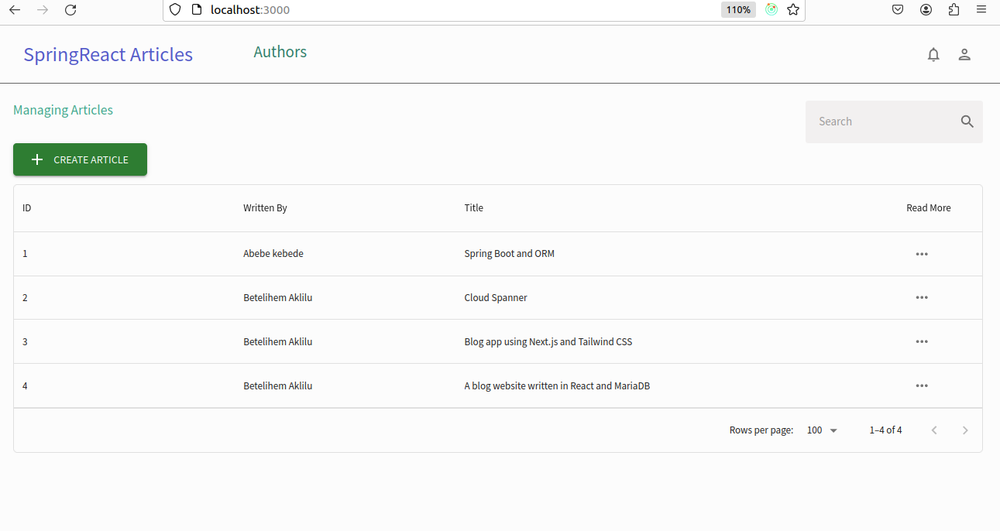
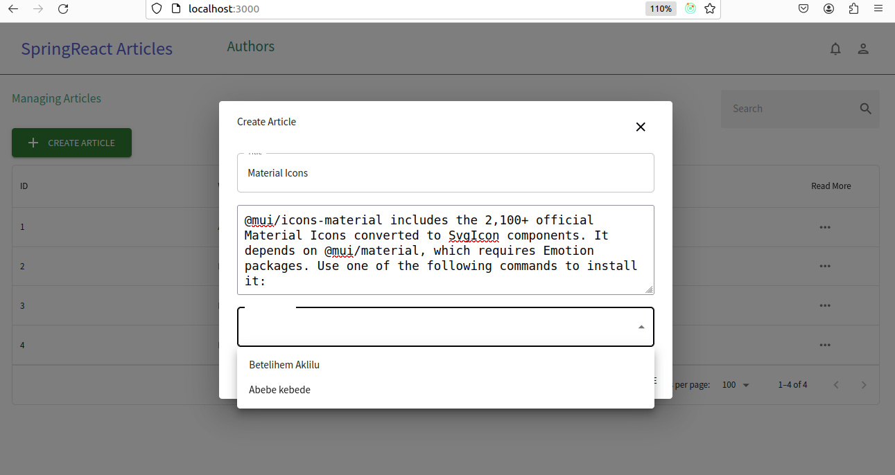

# SpringReact Articles Frontend

This repository contains the frontend implementation for the SpringReact Articles project. It is built using React and Redux to provide a user interface for managing and displaying articles.
This repo manages all the necessary to run the API needed for the project [SpringReact Articles Backend](https://github.com/worashf/springreact-articles-backend).

## Features

- Interaction with backend APIs for data retrieval and storage
- Functionalities to view, create, edit, and delete authors
- Functionalities to view, create articles

## Built With

- React.js
- Redux

## Getting Started

To run the project locally, follow these steps:

1. Clone this repository.
2. Install dependencies using `npm install`
3. Start the development server with `npm start`

##   List Articles

##  Create Article

##  Article Detail

## 1.5 Payment page

## 1.6  User profile page

## Contributing

Contributions are welcome! If you want to contribute to this project, please follow the guidelines in [CONTRIBUTING.md](CONTRIBUTING.md).

## License

This project is licensed under the [MIT License](LICENSE).
